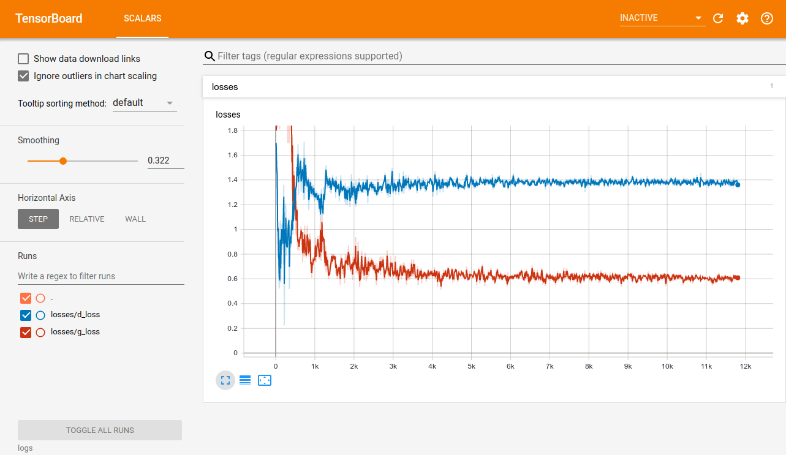
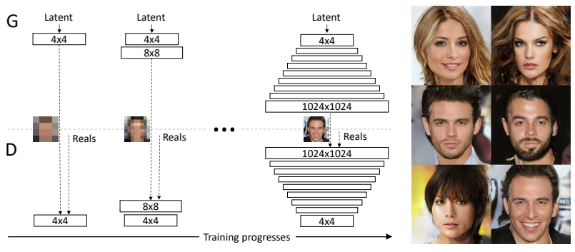

# PokeGAN

This repository is an ongoing implementation of shallow GAN architectures to generate Pokemons. The implementation is in PyTorch with tensorboard support for visualization.


## Installation

This project was developed in Python 3.7 with PyTorch 1.1. If you have a previous version of PyTorch, please consider switching `torch.utils.tensorboard` dependency to [tensorboardX](https://github.com/lanpa/tensorboardX).

```bash
git clone https://github.com/frgfm/PokeGAN.git
cd PokeGAN
pip install -r requirements.txt
mkdir data logs
```

Download the Kaggle dataset including all Pokemons from [here](https://www.kaggle.com/kvpratama/pokemon-images-dataset). And now unzip it using the following commands:

```bash
mv ~/Downloads/pokemon-images-dataset.zip .
unzip pokemon-images-dataset.zip
unzip pokemon.zip
rm pokemon.zip pokemon-images-dataset.zip
```

The image are in PNG format, better switch them to JPG (to avoid transparency handling later on):

```bash
python3 -c "from utils import convert_to_png; convert_to_png('pokemon', 'data/pokemon')"
rm -r pokemon
```


## Usage

How to train your model

### Jupyter notebook

Run your jupyter notebook

``` bash
jupyter notebook
```

and navigate to `poke_progan.ipynb` if you wish to train the networks by yourself.

### Running the tensorboard interface

Start the tensorboard server locally to visualize your training losses:

```bash
tensorboard --logdir=logs
```

Then open a new tab in your browser and navigate to `<YOUR_COMPUTER_NAME>:6006`  to monitor your training.




## Architecture & training scheme

### Architecture

Similar to DCGAN, but with weight initialization using normal distribution rather than uniform distribution. The Discriminator and the generators have mirrored architectures for downsampling and upsampling.


Tried InstanceNorm rather than BatchNorm but the latter proved to be more effective.


### Training scheme



*Source: Progressive Growing of GANs for improved quality, stability, and variation, ICLR 2018*

Using the idea suggested by ProGAN, the implementation include a progressive training scheme:

- We select a target image size and a starting size
- Each stage is characterized by a single output size (`[16, 32, 64]` for instance).
- Then each stage goes through a training cycle (sequence of epochs with identical learning rate, eg `[dict(lr=5e-4, nb_epochs=100), dict(lr=2e-4, nb_epochs=200)]`)
- When the training cycle is over, the output size is doubled. We recreate the discriminator and generators for this size (it adds a sampling layer to each network), load the weights learned in the previous stage to the appropriate layer, and freeze those already trained layers.
- The training stops when the training cycle with target size is over.


## Results

#### Stage 1 (16x16 images)

Samples


Gradient flow


#### Stage 2 (32x32 images)

Samples


Gradient flow


#### Stage 3 (64x64 images)

Samples


Gradient flow


## Submitting a request / Reporting an issue

Regarding issues, use the following format for the title:

> [Topic] Your Issue name

Example:

> [State saving] Add a feature to automatically save and load model states


## References

- DCGAN: [paper](https://arxiv.org/abs/1511.06434)
- ProGAN: [paper](https://arxiv.org/abs/1710.10196)