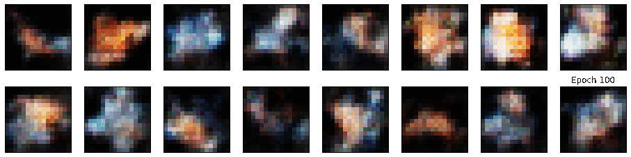
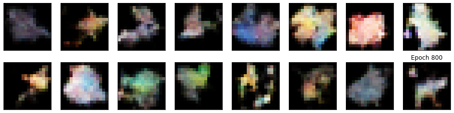
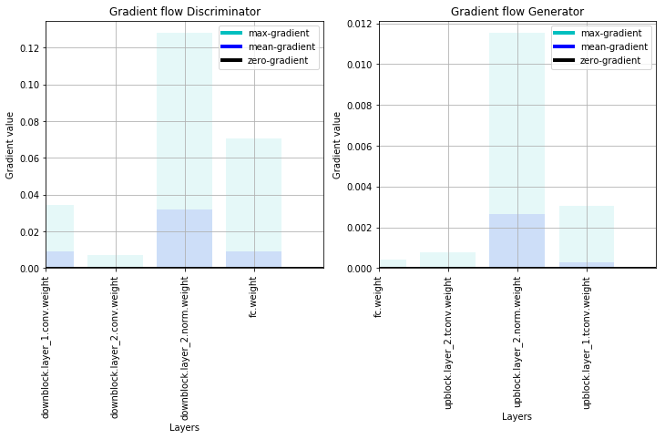
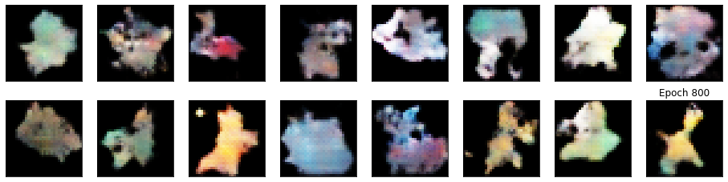
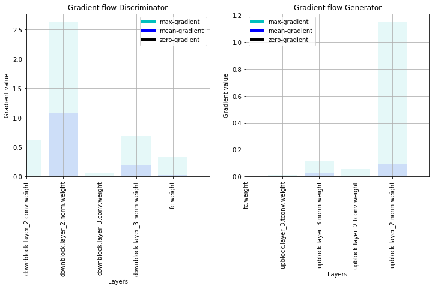
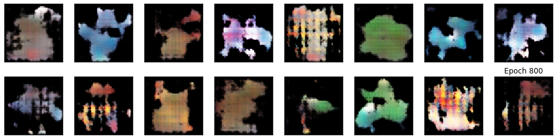
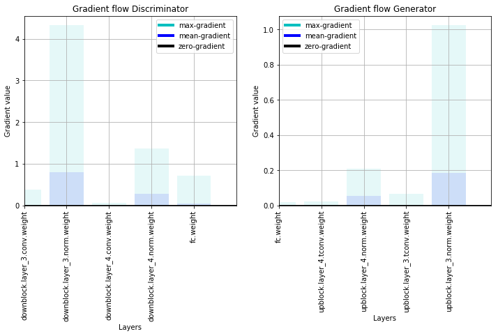

# PokeGAN

[](LICENSE)  [](https://codecov.io/gh/frgfm/Holocron) 

This repository is an ongoing implementation of shallow GAN architectures to generate Pokemons using PyTorch.





## Table of Contents

- [Getting Started](#getting-started)
  - [Prerequisites](#prerequisites)
  - [Installation](#installation)
- [Usage](#usage)
- [Contributing](#contributing)
- [Credits](#credits)
- [License](#license)


## Getting started

### Prerequisites

- Python 3.6 (or more recent)
- [pip](https://pip.pypa.io/en/stable/)
- Pokemon dataset from [Kaggle](https://www.kaggle.com/kvpratama/pokemon-images-dataset), or a static fallback provided by this [repo](https://github.com/frgfm/PokeGAN/releases/download/v0.1.0-data/pokemon_jpg.tar.gz). *Please note that if you use the original Kaggle version, it's better to switch the JPG images to PNG format (to avoid transparency handling later on)*

### Installation

You can install the project requirement as follows:

```bash
git clone https://github.com/frgfm/PokeGAN.git
pip install -r PokeGAN/requirements.txt
```

or install it as a package:

```bash
pip install git+https://github.com/frgfm/PokeGAN.git
```


## Usage

There are two available training script: `main.py` for classic DCGAN, and `progan.py` for ProGAN training. You can use the `--help` flag to get more advanced usage instructions.

```shell
usage: main.py [-h] [--size SIZE] [--device DEVICE] [--lr LR] [--dropout DROPOUT] [--z-size Z_SIZE]
               [--latent-size LATENT_SIZE] [--wd WEIGHT_DECAY] [--ls LABEL_SMOOTHING]
               [--noise NOISE] [--swap SWAP] [-b BATCH_SIZE] [--epochs EPOCHS] [-j WORKERS]
               data_path

Pokemon GAN Training

positional arguments:
  data_path             path to dataset folder

optional arguments:
  -h, --help            show this help message and exit
  --size SIZE           Image size to produce (default: 64)
  --device DEVICE       device (default: 0)
  --lr LR               initial learning rate (default: 0.001)
  --dropout DROPOUT     dropout rate (default: 0.3)
  --z-size Z_SIZE       number of features fed to the generator (default: 96)
  --latent-size LATENT_SIZE
                        latent feature map size (default: 4)
  --wd WEIGHT_DECAY, --weight-decay WEIGHT_DECAY
                        weight decay (default: 0)
  --ls LABEL_SMOOTHING, --label-smoothing LABEL_SMOOTHING
                        label smoothing (default: 0.1)
  --noise NOISE         Norm of the noise added to labels (default: 0.1)
  --swap SWAP           Probability of swapping labels (default: 0.03)
  -b BATCH_SIZE, --batch-size BATCH_SIZE
                        batch size (default: 32)
  --epochs EPOCHS       number of total epochs to run (default: 400)
  -j WORKERS, --workers WORKERS
                        number of data loading workers (default: 16)
  --output-file OUTPUT_FILE
                        path where to save (default: ./gan.pth)
```


## Architecture & training scheme

### Architecture

Similar to DCGAN, but with weight initialization using normal distribution rather than uniform distribution. The Discriminator and the generators have mirrored architectures for downsampling and upsampling.


Tried InstanceNorm rather than BatchNorm but the latter proved to be more effective.


### Training scheme


*Source: Progressive Growing of GANs for improved quality, stability, and variation, ICLR 2018*

Using the idea suggested by ProGAN, the implementation include a progressive training scheme:

- We select a target image size and a starting size
- Each stage is characterized by a single output size (`[16, 32, 64]` for instance).
- Then each stage goes through a training cycle (sequence of epochs with identical learning rate, eg `[dict(lr=5e-4, nb_epochs=100), dict(lr=2e-4, nb_epochs=200)]`)
- When the training cycle is over, the output size is doubled. We recreate the discriminator and generators for this size (it adds a sampling layer to each network), load the weights learned in the previous stage to the appropriate layer, and freeze those already trained layers.
- The training stops when the training cycle with target size is over.


## Experiments

Things that were tested to improve training:

- **Normalization**: batch normalization, instance normalization, local response normalization, layer normalization, spectral normalization.
- **Kernel size**: raising the generator kernel size from 3x3 to 5x5 to get smoother results.
- **Learning rate**: scaling down the learning rate by a factor (<= 1) for the generator leads to easier convergence towards a local Nash Equilibrium.
- **GAN loss**: standard loss, relativistic loss, relativistic average loss

And other tricks to be implemented soon:

- Gradient penalty & consistency term


### Results

#### Stage 1 (16x16 images)

Samples



Gradient flow



#### Stage 2 (32x32 images)

Samples



Gradient flow



#### Stage 3 (64x64 images)

Samples (mode collapse)



Gradient flow




## Contributing

Regarding issues, use the following format for the title:

> [Topic] Your Issue name

Example:

> [State saving] Add a feature to automatically save and load model states


## Credits

- DCGAN: [paper](https://arxiv.org/abs/1511.06434)
- ProGAN: [paper](https://arxiv.org/abs/1710.10196)
- Two Time-Scale Update Rule: [paper](https://arxiv.org/abs/1706.08500)
- Gradient penalty: [paper](https://arxiv.org/abs/1704.00028) ([implementation](https://github.com/EmilienDupont/wgan-gp))
- Consistency term: [paper](https://arxiv.org/abs/1803.01541) ([implementation](https://github.com/pYtoner/CT-GAN))
- Spectral normalization: [paper](https://arxiv.org/abs/1802.05957) ([implementation](https://pytorch.org/docs/stable/_modules/torch/nn/utils/spectral_norm.html))
- RaGAN: [paper](https://arxiv.org/abs/1807.00734)


## License

Distributed under the MIT License. See `LICENSE` for more information.